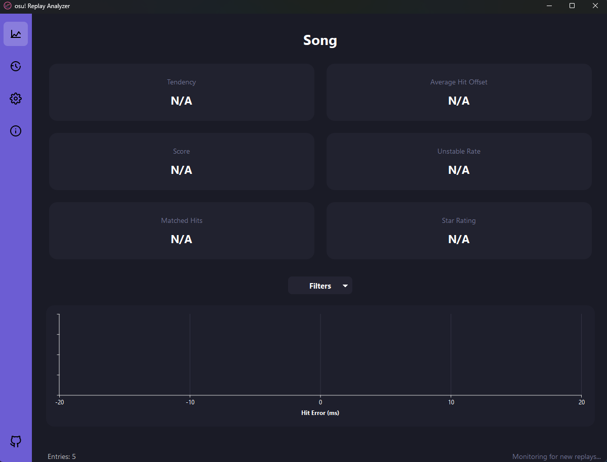

# osu! Replay Analyzer (v2 - GUI Refactor)

*Made collaboratively with AI assistance. If you encounter issues or have feedback, please open an Issue on GitHub.*

This application monitors your osu! Replays folder, automatically analyzes newly created standard mode replays (.osr files), and provides insights into your timing consistency and accuracy via a user-friendly graphical interface.



## Key Features

*   **Automatic Monitoring & Analysis:** Detects and analyzes new replays in the background as soon as they are saved in your configured osu! Replays folder.
*   **Modern GUI Interface:** Displays results and statistics clearly across different sections (Analyzer, History, Settings, Info).
*   **Analyzer Tab:** Shows key metrics (Average Hit Offset, UR, Score, etc.) and visualizes the hit error distribution for the last analyzed play. Selectable overlays show Average Offset, UR range, and individual hits.
*   **History Tab:** Saves all analysis results locally (`analysis_stats.csv`) and displays them grouped by beatmap. Your best score for each map is highlighted. Supports filtering and sorting.
*   **System Tray Integration:** Options to minimize to the system tray, show notifications, and launch minimized.
*   **osu! Process Integration (Optional):** Can automatically start/stop monitoring when `osu!.exe` starts/stops (requires the `psutil` library).
*   **Configuration:** Easily configure osu! paths, analysis offset, logging level, and application behavior via the Settings tab.

## Installation (Recommended: Windows Installer)

1.  **Download:** Go to the [Releases Page](https://github.com/Luskebusk/osu-replay-offset-analyzer/releases) on GitHub.
2.  Download the latest `OsuAnalyzerSetup-vX.Y.Z.exe` file (replace X.Y.Z with the actual version).
3.  **Run Installer:** Execute the downloaded `.exe` file. It will guide you through the installation. Administrator privileges might be required if installing to the default Program Files location.
4.  **Shortcuts:** The installer creates Start Menu shortcuts and offers an optional Desktop shortcut.

## Building from Source (Alternative)

If you prefer not to use the installer, you can run the application directly from the source code:

1.  **Clone Repository:**
    ```bash
    git clone https://github.com/Luskebusk/osu-replay-offset-analyzer.git
    cd osu-replay-offset-analyzer
    ```
2.  **Install Dependencies:** Ensure you have Python 3 installed. Then run:
    ```bash
    pip install -r requirements.txt
    ```
    *(Optional: It's recommended to do this within a Python virtual environment).*
3.  **Run Application:**
    ```bash
    python main_app.py
    ```

## Configuration

1.  **First Run / Setup:** When you run the application for the first time (either installed or from source), navigate to the **Settings** tab.
2.  **Configure Paths:** Set the correct paths for:
    *   **osu! Replays Folder:** (e.g., `C:/Users/YourUsername/AppData/Local/osu!/Replays`)
    *   **osu! Songs Folder:** (e.g., `C:/Users/YourUsername/AppData/Local/osu!/Songs`)
    *   **osu!.db Path:** (e.g., `C:/Users/YourUsername/AppData/Local/osu!/osu!.db`)
3.  **Other Settings:** Adjust optional settings like Log Level, Replay Time Offset, and Behavior toggles as needed.
4.  **Save Settings:** Click the "Save Settings" button. The application needs these paths to function correctly.
5.  **Manual Config:** The configuration is stored in `config.ini` located at `%LOCALAPPDATA%\OsuAnalyzer\config.ini`. You can edit this manually if necessary.

## Running the Application

1.  **Launch:** Use the shortcuts (if installed) or run `python main_app.py` (if running from source).
2.  **Initialization:** The application will load your `osu!.db` (this may take some time depending on its size) and start monitoring if enabled.
3.  **Status:** Check the status bar at the bottom for current activity (e.g., "Monitoring...", "Analyzing...", "Ready.").
4.  **Play osu!:** Play osu! standard maps as usual.
5.  **Analysis:** After a replay is saved, the application should automatically analyze it (if monitoring is enabled). Results appear on the "Analyzer" tab and are added to the "History" tab.
6.  **Review:** Explore the Analyzer, History, and Info tabs. Adjust settings as needed.

## Understanding the Analyzer Tab

*   **Stat Cards:** Show key metrics for the last analyzed play.
*   **Hit Error Graph:** Visualizes the distribution of your hit timing errors (0ms = perfect timing).
    *   **Main Curve:** Shows the frequency (count) of hits at different millisecond offsets.
    *   **Overlays (Toggled via Dropdown):**
        *   `Average Hit Offset`: A solid line indicating your average timing error.
        *   `Tendency`: A dotted line at the same position as Average Hit Offset, just for visual distinction.
        *   `Unstable Rate`: Dashed lines showing ±1 Standard Deviation from the average offset.
        *   `Matched Hits`: Scatter points showing the offset of each individual hit analyzed.

Use this information to potentially adjust your global offset in osu! or identify patterns in your timing consistency.

## Troubleshooting

*   **Application doesn't start / Errors:**
    *   Verify all paths are correctly set in Settings.
    *   Check the log file (`%LOCALAPPDATA%\OsuAnalyzer\log.txt`). Enable DEBUG logging in Settings for more detail.
    *   Ensure dependencies are installed (`pip install -r requirements.txt` if running from source).
    *   Your `osu!.db` might be corrupted. Try letting osu! regenerate it (close osu!, delete/rename the file, start osu!). *Use as a last resort.*
    *   If using the installed version, try reinstalling.
*   **"Map not found" / Analysis Failures:** The beatmap hash might not be in `osu!.db` yet (play the map once) or the replay/map file could be corrupted/unsupported.
*   **Incorrect Offset/UR:** Adjust the "Replay Time Offset (ms)" setting (default: -8) to calibrate for your system/latency.
*   **Start/Stop with osu! Not Working:** This requires `psutil`. Install it (`pip install psutil`) if running from source. The feature might still be unreliable on some systems.

## Dependencies

*   PyQt6
*   PyQt6-Charts
*   osrparse
*   watchdog
*   psutil (Optional, for osu! process monitoring)
*   construct

## Credits & Acknowledgements

*   **osrparse:** [https://github.com/kszlim/osu-replay-parser](https://github.com/kszlim/osu-replay-parser)
*   **watchdog:** [https://github.com/gorakhargosh/watchdog](https://github.com/gorakhargosh/watchdog)
*   **construct:** [https://github.com/construct/construct](https://github.com/construct/construct)
*   **osu!db Parser Base:** [https://github.com/KirkSuD/osu_db_kaitai_struct](https://github.com/KirkSuD/osu_db_kaitai_struct)
*   **.osu Parser Base:** [https://github.com/Awlexus/python-osu-parser](https://github.com/Awlexus/python-osu-parser)
*   **Icons:** Some icons provided by GitHub, others custom made.

## Feedback & Issues

Please report bugs, suggest features, or provide feedback by opening an issue on the [GitHub repository issues page](https://github.com/Luskebusk/osu-replay-offset-analyzer/issues). 